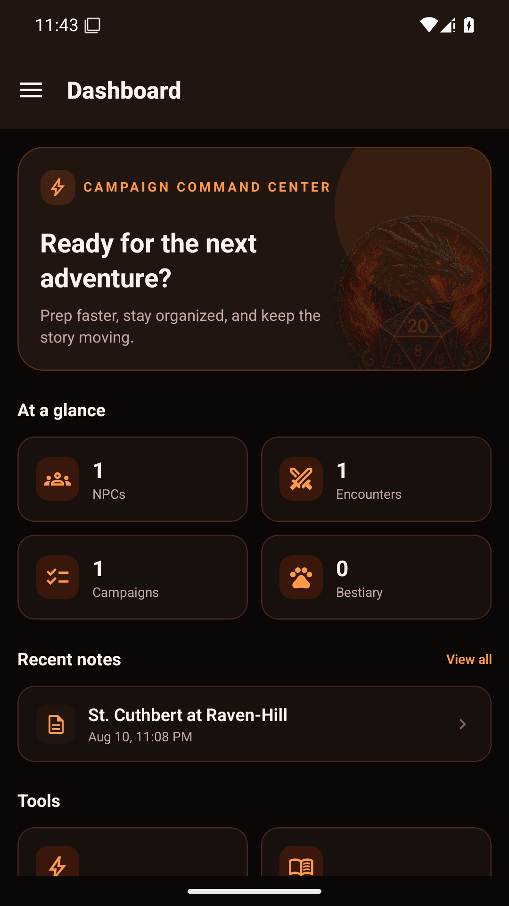
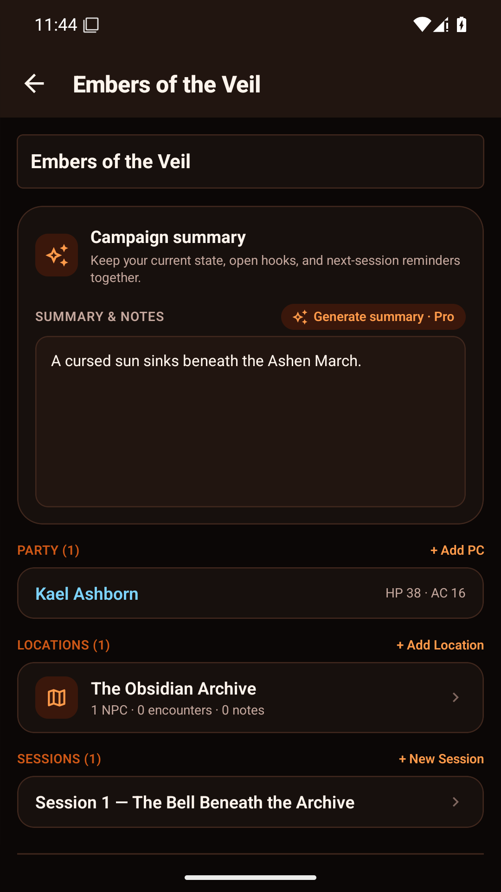
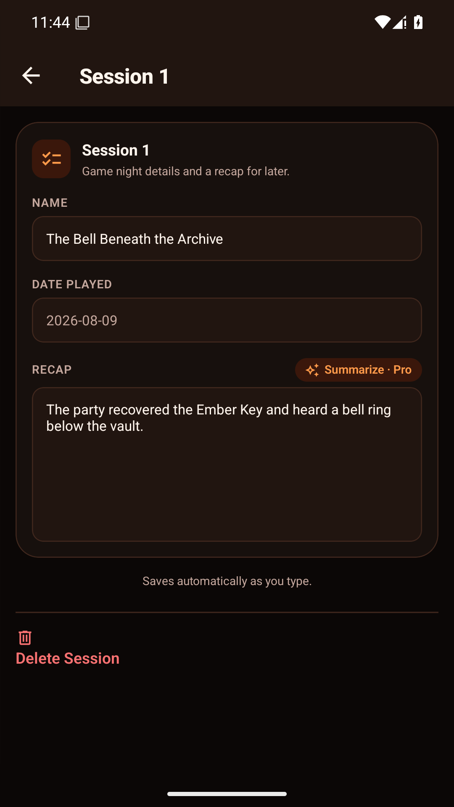
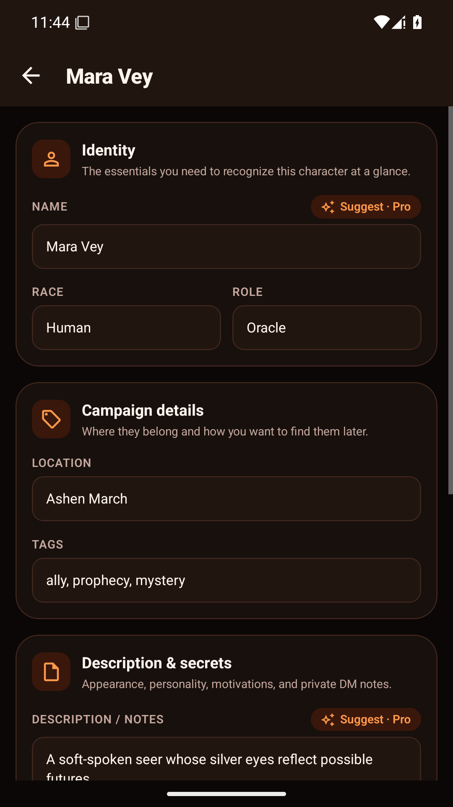
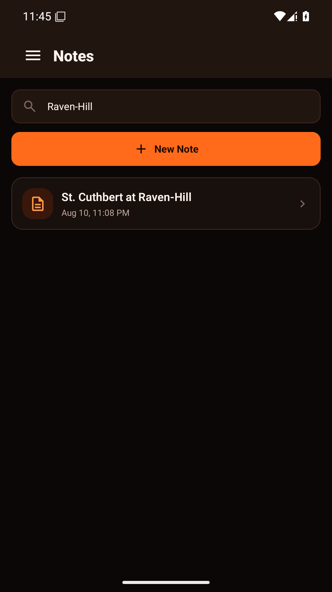
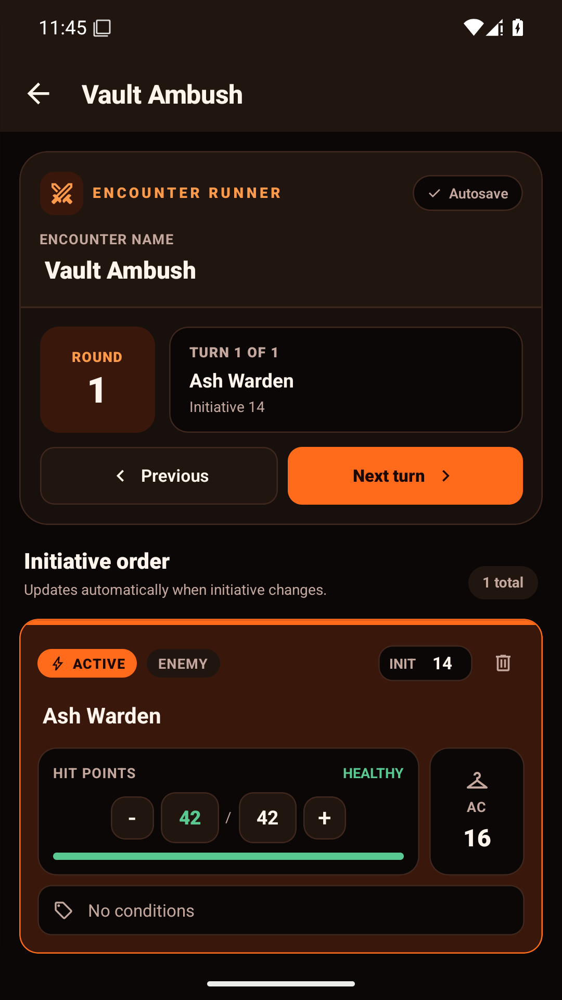
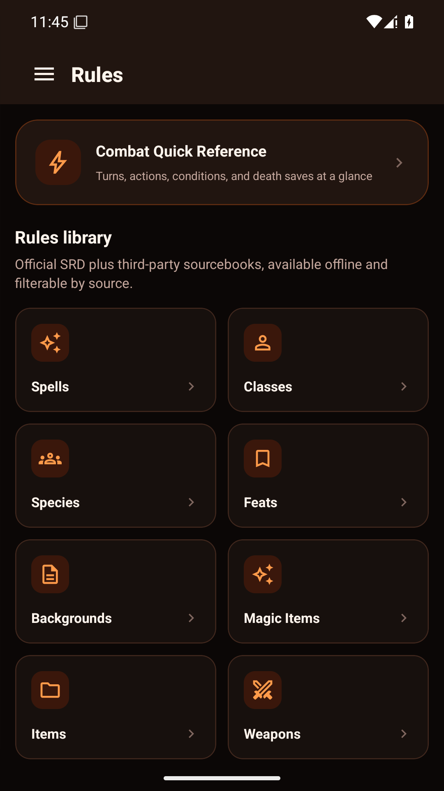
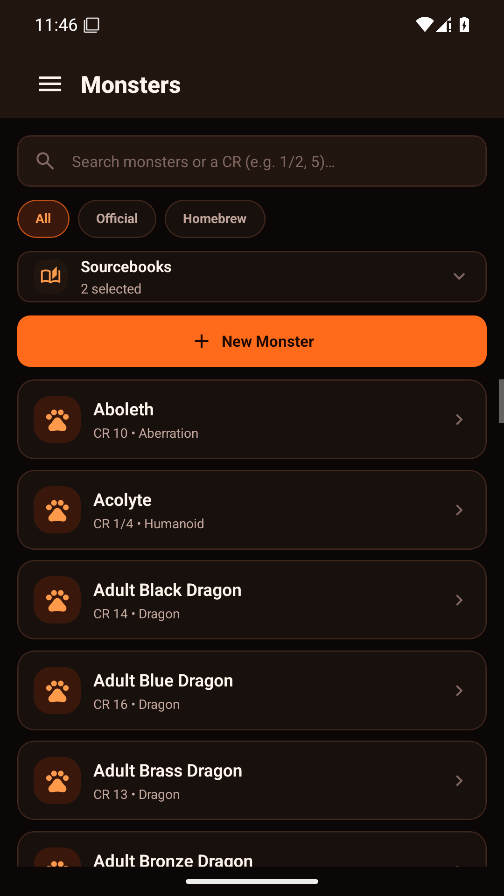

<div align="center">

# 🎲 Infernal Codex — Mobile

**A standalone Android/iOS app for running D&D 5e games — rules, NPCs, notes, encounters, maps, and AI-assisted prep, entirely on your phone.**

[](https://expo.dev)
[](https://www.typescriptlang.org/)

</div>

---

**Infernal Codex** is a native mobile port of the DM Assistant desktop/web app (a separate sibling project, same original name) — same idea, but no PC required. Campaign data runs on-device through local SQLite, with a bundled offline SRD ruleset and no account or cloud sync. The free plan includes one campaign without AI; Infernal Codex Pro unlocks unlimited campaigns and AI tools through a shared, entitlement-gated proxy.

## Screenshots

<table>
  <tr>
    <td></td>
    <td></td>
    <td></td>
    <td></td>
  </tr>
  <tr>
    <td></td>
    <td></td>
    <td></td>
    <td></td>
  </tr>
</table>

7-inch and 10-inch tablet captures are in [`docs/store-screenshots/`](docs/store-screenshots/).

## Features

- 📖 **Rules** — spells, conditions, classes, species, feats, backgrounds, items, weapons, and armor from the D&D 5e SRD (2014 & 2024) plus ~20 third-party sourcebooks, bundled with the app and fully readable offline. Filter by source, plus a combat quick-reference page (actions, conditions, death saves, cover) for use at the table.
- 🐉 **Monsters** — official SRD creatures and your own homebrew in one searchable list, filterable to All / Official / Homebrew, searchable by name or challenge rating.
- 🎭 **NPCs** — name, race, role, location, tags, and freeform notes, with Pro AI suggestions for names and descriptions.
- 📝 **Notes** — markdown campaign notes with full-text search (SQLite FTS5).
- 🗺️ **Campaigns** — a persistent party roster plus a set of Locations per campaign; each Location shows every NPC who's shown up there, every encounter that's happened (or is planned) there, and every note tagged to it. Log an NPC's appearance at a location and session number, and their full history is searchable from their own page — the data model behind this is deliberately shaped for AI-assisted recap and search down the line.
- ⚔️ **One-Shot Encounters** — a quick, unlinked combat tracker for anything not tied to a campaign: official SRD monsters, your own homebrew, or one-off custom combatants. Starting an encounter from inside a Location links it automatically instead. Live initiative order, HP, AC, and condition tracking, autosaving as you play.
- 🗂️ **Maps** — attach map images from your photo library or save links to maps hosted elsewhere; a Location can optionally reuse one.
- 📄 **PDF import (Pro)** — pick a sourcebook or homebrew PDF and Claude reads it through the shared proxy to pull out NPCs, monster stat blocks, and standalone rules. Nothing saves automatically — review and approve on a staging screen first.
- 💾 **Backup & restore** — export every table plus your map images to one file via the share sheet; restore it on a new phone in a couple taps.
- ⚙️ **Free & Pro** — Free includes one campaign and all non-AI tools. Pro adds unlimited campaigns, NPC generation, campaign/session summaries, and PDF import. Google Play purchases are managed through RevenueCat.

## Installing

Currently in a private Google Play closed test (invite-only, United States) — not publicly listed yet. See [`docs/Remaining-until-published.md`](docs/Remaining-until-published.md) for where that stands. Three Android builds also live in [`builds/`](builds/) (tracked via Git LFS) for trying it out directly without Play:

- **`*-preview.apk`** — standalone, install and run on its own like any normal app, no computer needed. This is what you want for just trying it out.
- **`*-dev.apk`** — a development-client build for active coding on this repo. After installing it, run `npm install && npx expo start` and open the app — it connects to the dev server automatically over the same WiFi network.
- **`*-production.aab`** — the actual Play Store submission artifact. Not directly installable (Android App Bundles need Play Console or `bundletool` to produce an installable APK) — this one's for store upload, not for trying the app out.

**iOS:** no build yet.

## Your data

Campaign data — NPCs, notes, encounters, maps, and your bestiary — lives on your device in SQLite and device storage; it is not cloud-synced. When a Pro user deliberately runs an AI feature, only the content needed for that request is sent over HTTPS through the Infernal Codex Cloudflare Worker to Anthropic. RevenueCat receives an anonymous app-user ID and purchase/subscription records to provide Pro access. The Worker does not persist prompt or response content.

Public policies: [Privacy Policy](https://joshcookwv.github.io/dm-assistant-mobile/privacy/) · [SRD & Open Content Licenses](https://joshcookwv.github.io/dm-assistant-mobile/licenses/) · [Report an issue](https://github.com/joshcookwv/dm-assistant-mobile/issues/new)

## Tech stack

| | |
|---|---|
| **Framework** | [Expo](https://expo.dev) / React Native (SDK 56, TypeScript, Expo Router) |
| **Database** | On-device SQLite via [`expo-sqlite`](https://docs.expo.dev/versions/latest/sdk/sqlite/) |
| **Rules data** | [Open5e v2 API](https://api.open5e.com/v2/) — official SRD (2014 + 2024) plus third-party sourcebooks, bundled as app assets |
| **AI** | [Claude API](https://www.anthropic.com/api), reached through an entitlement-gated Cloudflare Worker with prompt caching |
| **Purchases** | Google Play Billing through [RevenueCat](https://www.revenuecat.com/) |
| **Styling** | [NativeWind](https://www.nativewind.dev/) (Tailwind for React Native) |
| **Secrets** | Anthropic and RevenueCat secret keys remain server-side; only RevenueCat's public app key ships in the client |

## Project structure

```
src/
  app/            Expo Router screens (file-based routing)
  components/     Shared UI components
  lib/            Data layer (SQLite), AI client, SRD data loader
  constants/      Theme tokens, navigation option presets
  hooks/          Shared hooks (debounce, etc.)
assets/
  srd/            Bundled offline SRD rules data
  images/         App icon, splash screen, adaptive icon layers
builds/           Built APKs (Git LFS)
docs/             Screenshots, store submission plan
```

## License

Application source code is MIT licensed.

Rules and Monsters content is bundled from the [Open5e](https://open5e.com/) project — the D&D 5e System Reference Documents (SRD 5.1 "2014" and SRD 5.2 "2024") plus ~20 third-party sourcebooks (Kobold Press, Green Ronin, and others) — each licensed separately by its original publisher under [Creative Commons Attribution 4.0](https://creativecommons.org/licenses/by/4.0/legalcode) and/or the [Open Game License v1.0a](https://www.d20srd.org/ogl.htm). No bundled content has been modified beyond formatting for display.

The exact required CC-BY attribution sentences, the full OGL 1.0a text, and a Section 15 copyright notice for every bundled source are published at [SRD & Open Content Licenses](https://joshcookwv.github.io/dm-assistant-mobile/licenses/) — the same page the in-app Settings → Legal & Licenses button opens.

Infernal Codex is an independent project and is not affiliated with, endorsed by, or sponsored by Wizards of the Coast.
