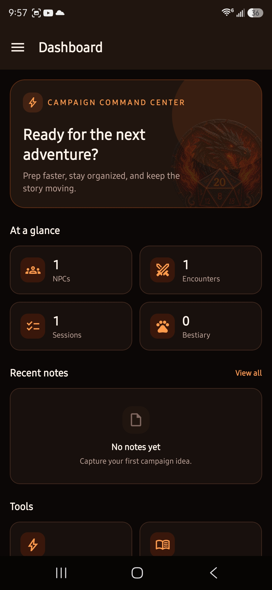
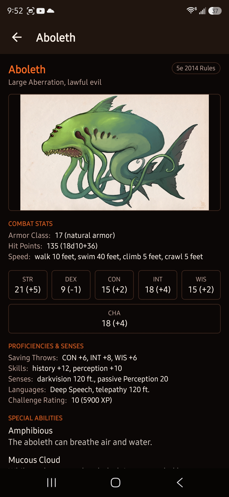
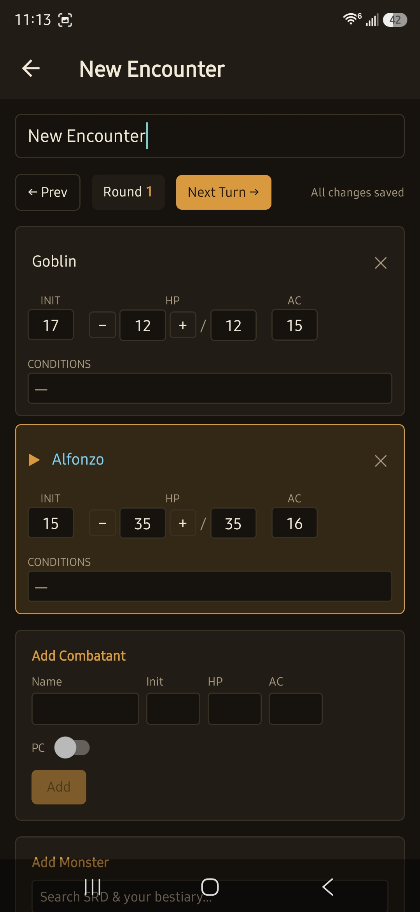
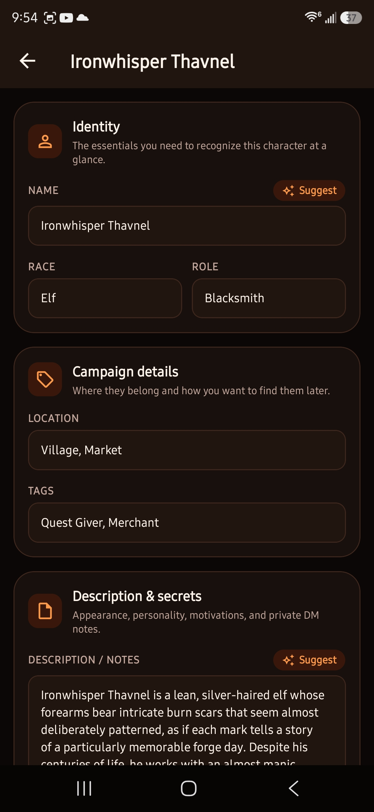
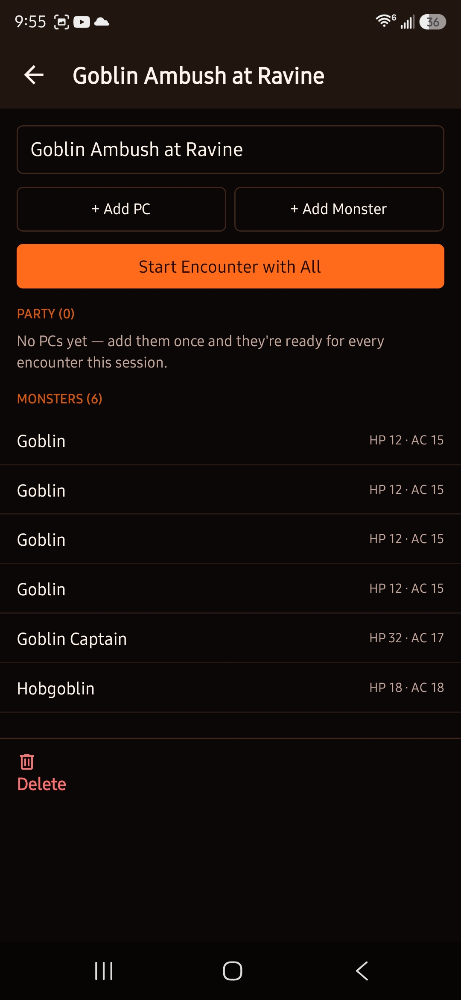
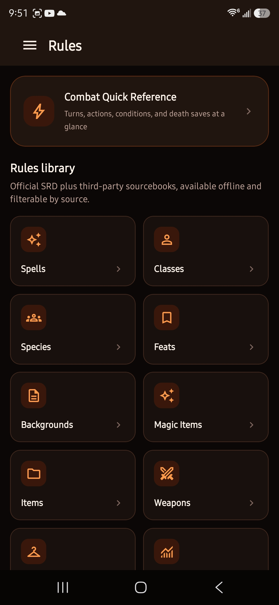

# Store submission plan

Status: **not yet submitted anywhere.** This document is a working checklist plus draft listing copy — everything in the "Draft listing" section is meant to be edited before it goes live.

## 1. Platform order

**Recommendation: Google Play first, App Store later.**

- Play Store: one-time $25 registration fee, builds happen in EAS's cloud with no Mac needed, review is typically hours to ~2 days for a new developer account.
- App Store: requires an active Apple Developer Program membership ($99/**year**, recurring), and while EAS can build iOS in the cloud without a Mac, TestFlight/App Store Connect setup and screenshots still need to happen through Apple's tooling. Review is typically 1–3 days but first-time developer accounts sometimes see extra scrutiny.

Since there's no iOS build yet at all (see README), doing Android first gets something live faster and de-risks the listing/policy work before paying for the Apple side.

## 2. Before building for production

- [x] Switch from `development` to `production` EAS profile — built 2026-08-07, `.aab`, 83MB, versionCode auto-incremented to 3 (see [`builds/dm-assistant-mobile-v1.0.0-production.aab`](../builds/)). **This is the Play Store submission artifact — it is not directly installable on a device**, unlike the `.apk` files also in that folder.
- [x] Versioning: `eas.json`'s `"appVersionSource": "remote"` + `production.autoIncrement: true` handled the build number automatically (2 → 3). `"version"` in `app.json` stays `1.0.0` until the first real user-facing release.
- [x] EAS-managed Android signing keystore — default behavior, used automatically.
- [ ] **Test the actual production `.aab` on-device before submitting** — still outstanding. `.aab` isn't directly installable, so this needs either `bundletool` to derive an installable `.apk` locally, or Play Console's internal testing track (uploads the `.aab`, gives you an installable link). Dev and production builds can behave differently (this project in particular: PDF import only started working under a real dev-client build vs. Expo Go), so don't assume production behaves identically to the `preview` build already tested without checking.

## 3. Required before Play Store will accept the listing

- [x] **Privacy policy URL.** Live at https://joshcookwv.github.io/dm-assistant-mobile-support/ — a small standalone public repo ([`joshcookwv/dm-assistant-mobile-support`](https://github.com/joshcookwv/dm-assistant-mobile-support)) since the app's source repo is private and GitHub Pages can't be made public from a private repo without a paid plan. Same page also hosts the public issue tracker, linked from the app's Settings screen. **Still needed:** paste this URL into Play Console's "App content" → "Privacy policy" field once you're in there.
- [ ] **Data safety form** (Play Console → App content → Data safety). Draft answers:
  - Does your app collect or share user data? **Yes** — campaign content (NPC names/details, PDF contents) is sent to Anthropic's API, but *only* when the user actively taps an AI feature and *only* after the user supplies their own API key.
  - Data collected: none stored or transmitted by the app's own servers (it has none). Third-party sharing: user-initiated content sent to Anthropic when AI features are used.
  - Is data encrypted in transit? Yes (HTTPS to Anthropic).
  - Can users request data deletion? N/A — nothing is stored outside the user's own device; uninstalling the app deletes everything.
- [ ] **Content rating questionnaire** (IARC, via Play Console). Expect a **Teen** rating (fantasy violence references in monster stat blocks/combat descriptions) — answer honestly; this is a standard TTRPG-content rating, not a red flag.
- [ ] **Target audience & content**: mark as not directed at children (13+ is the realistic floor given D&D content).
- [x] **App icon** for the store listing: 512×512 PNG, 32-bit with alpha. Downscaled from the in-app icon — [`docs/store-assets/app-icon-512.png`](store-assets/app-icon-512.png).
- [x] **Feature graphic**: 1024×500, shown at the top of the store listing. Recreated at full resolution from the dashboard hero banner's actual design (same colors/copy/logo treatment, not just a cropped screenshot) — [`docs/store-assets/feature-graphic.jpg`](store-assets/feature-graphic.jpg) (upload this one — Play rejects alpha on this slot) or [`.png`](store-assets/feature-graphic.png) (also alpha-free).
- [x] **Screenshots**: minimum 2, Play Store recommends 4–8. Phone screenshots need to be actual device captures (not simulator chrome) at a minimum 320px, max 3840px on the longest side. Re-captured post-rebrand — see [`docs/screenshots/`](screenshots/) and the preview below. 15 real device captures at 1080×2340, well within Play's size requirements; a subset doubles as the README's showcase images.
- [ ] **Short description**: max 80 characters.
- [ ] **Full description**: max 4000 characters.

## 4. Known gaps to resolve before submitting (not just before it "looks nice")

- [ ] iOS build doesn't exist yet — out of scope for a Play Store submission, but blocks any App Store submission.
- [x] `production`-profile build succeeded (outputs an `.aab`, the Play Store submission format — not directly installable) — see section 2 above. A `preview`-profile build (same stripped-down non-dev-client code, but an installable `.apk`) has been built for on-device testing after each major change, most recently post-rebrand/UI-refresh — see [`builds/dm-assistant-mobile-v1.0.0-preview.apk`](../builds/). Multi-day on-device pass on that standalone build: **complete.**
- [x] Screenshots captured — see section 3 above.
- [x] **SRD content licensing — researched and fixed.** Full writeup in section 7 below. Verdict was: both OGL 1.0a and CC-BY-4.0 explicitly permit exactly this (compiling into a distributed app, commercial use included) — bundling vs. fetching-at-runtime makes no legal difference — but the app was missing the notice/attribution text both licenses make mandatory as the condition of that permission. **Fixed:** added a Legal &amp; Licenses screen (`src/app/settings/legal.tsx`, reached via a button at the bottom of Settings) containing the CC-BY attribution sentences, the full OGL 1.0a text, and the generated Section 15 notice.
- [ ] Uninstall the orphaned `com.joshcook.dmassistant` dev-client build from your test device — it's a different package than the current `com.infernalbulldog.dmassistant`, so it's safe to remove, but has to be done on-device (long-press the icon → Uninstall).

## Screenshot preview

<table>
<tr>
<td width="33%"></td>
<td width="33%"></td>
<td width="33%"></td>
</tr>
<tr>
<td width="33%"></td>
<td width="33%"></td>
<td width="33%"></td>
</tr>
</table>

Nine more captures not shown above (`API-Settings`, `Encounter-1`, `Map-Import`, `Monster-1`, `NPC-1`, `NPC-3`, `Notes`, `PDF-Import`, `Session-1`) are available in the same folder if the listing wants more than 6.

## 5. Draft listing copy

Everything below is a first draft for you to edit, not final copy.

### App name
Infernal Codex

### Short description (≤80 chars)
> Offline D&D 5e rules, NPCs, encounters, and AI prep tools — no PC needed.

*(79 characters)*

### Full description (≤4000 chars)

> **A private, standalone toolkit for running D&D 5e — entirely on your phone.**
>
> Infernal Codex puts your campaign prep in one place instead of ten browser tabs: a full offline SRD rules reference, a combat tracker that keeps up with the table, and optional AI assistance that only runs when you ask it to.
>
> Everything lives on your device. There's no account, no cloud sync, and no telemetry — your campaign never leaves your phone unless you choose to use an AI feature, which requires your own Claude API key.
>
> **Features:**
> • Rules — spells, conditions, classes, species, feats, backgrounds, magic items, equipment, weapons, and armor from the D&D 5e SRD (2014 and 2024 rulesets), plus dozens of third-party sourcebooks — all bundled with the app and readable with no internet connection, plus a combat quick-reference page for the table.
> • Monsters — official SRD creatures and your own homebrew in one searchable list, filterable to Official or Homebrew, searchable by name or challenge rating.
> • NPCs — track name, race, role, location, and notes, with optional AI-suggested names and descriptions.
> • Notes — searchable markdown campaign notes.
> • Session — stage PCs and monsters ahead of game night across any number of named sessions, then drop a full roster into an encounter in one tap.
> • Encounters — a live combat tracker: initiative order, HP, AC, and conditions, built from a prepared session, official monsters, or your own homebrew.
> • Maps — attach images from your photo library or link out to maps hosted elsewhere.
> • PDF import — point it at a sourcebook or homebrew PDF and Claude reads it directly, pulling out NPCs, stat blocks, and rules text for you to review before anything saves.
>
> Bring your own Claude API key (optional, from console.anthropic.com) to unlock the AI features. Everything else works with zero configuration.

### Category
Tools, or Entertainment (Play Console offers both — Tools fits the "utility app" framing better than Entertainment/Games, since this isn't itself a game)

### Tags/keywords (not a formal Play Store field, but useful for the description/ASO)
D&D, Dungeons and Dragons, 5e, DM tools, tabletop RPG, dungeon master, TTRPG, combat tracker, SRD

## 6. Privacy policy — live

Hosted at https://joshcookwv.github.io/dm-assistant-mobile-support/ ([source](https://github.com/joshcookwv/dm-assistant-mobile-support)) — paste that URL into Play Console. The text below is what's actually live there; edit the repo directly if it ever needs updating, this copy is just for reference.

> **Privacy Policy — Infernal Codex**
>
> Infernal Codex does not collect, store, or transmit any personal data to its developer. All campaign data — NPCs, notes, encounters, maps, sessions, and your homebrew monsters — is stored locally on your device and never leaves it.
>
> **AI features (optional).** If you choose to add a Claude API key in Settings and use an AI-assisted feature (NPC suggestions or PDF import), the relevant content (e.g. an NPC's name/race/role, or a PDF's contents) is sent directly from your device to Anthropic's API (anthropic.com) to generate a response. Your API key is stored only in your device's secure keychain. See Anthropic's own privacy policy for how they handle that data: https://www.anthropic.com/legal/privacy
>
> **No analytics, no tracking, no ads.** This app contains no third-party analytics, advertising, or tracking SDKs of any kind.
>
> **Data deletion.** Since nothing is stored outside your device, uninstalling the app removes all app data. There is no account to delete.
>
> **Contact.** Use the [issue tracker](https://github.com/joshcookwv/dm-assistant-mobile-support/issues/new) for any privacy questions.

## 7. SRD content licensing (researched 2026-08-06)

This isn't formal legal advice, but it's grounded in the actual primary sources (the OGL 1.0a full text, Creative Commons' own legal code, Wizards' own published attribution requirements) rather than assumption — worth a quick lawyer glance before submitting given real stakes, but this is also an extremely well-trodden pattern; every 5e digital tool built on Open5e/OGL/CC content does some version of what's below.

**Verdict: distributing this content inside the app is fine — both licenses explicitly permit exactly that, bundled or fetched-live makes no legal difference. What's actually missing is the notice/attribution text both licenses make *mandatory* as the condition of that permission. Right now the app has zero license or attribution text anywhere. That's the real, fixable gap — not "can we ship this," but "we're not done complying yet."**

### What's actually bundled (from `assets/srd/sources.srddata`, 20 sources)

| License | Sources |
| --- | --- |
| **CC-BY-4.0** | WotC SRD 2014 (`srd-2014`, dual-licensed — see below), WotC SRD 2024 (`srd-2024`), Black Flag SRD (Kobold Press), Spells That Don't Suck (Somanyrobots), Open5e's `core` compilation (dual) |
| **OGL 1.0a only** (no CC alternative) | Creature Codex, Deep Magic, Deep Magic Extended, Kobold Press Compilation, Tome of Beasts 1/2/3 (+2023 ed.), Tome of Heroes, Vault of Magic, Warlock Zine (all Kobold Press) · Tal'dorei Campaign Setting (Green Ronin) · Open5e Originals (2014 & 2024) |
| **CC0** (public domain, no attribution legally required) | Elderberry Inn Icons |

Open5e itself imposes no additional terms beyond passing through these upstream licenses (confirmed via their API repo) — it's a pure aggregator, same as it appears to WotC/Kobold Press/etc.

### The CC-BY-4.0 path (simpler — use this for everything dual-licensed)

`srd-2014` and `core` are dual-licensed (OGL *or* CC-BY, your choice) — CC-BY is far less burdensome (one attribution block vs. OGL's Section 15 chain + full license text), so use it for those. Wizards publishes an **exact required sentence** for each SRD version — don't paraphrase it, use it verbatim:

- **SRD 5.1 (2014 rules):** "This work includes material taken from the System Reference Document 5.1 ("SRD 5.1") by Wizards of the Coast LLC and available at https://dnd.wizards.com/resources/systems-reference-document. The SRD 5.1 is licensed under the Creative Commons Attribution 4.0 International License available at https://creativecommons.org/licenses/by/4.0/legalcode."
- **SRD 5.2 (2024 rules):** "This work includes material from the System Reference Document 5.2 ("SRD 5.2") by Wizards of the Coast LLC, available at https://www.dndbeyond.com/srd. The SRD 5.2 is licensed under the Creative Commons Attribution 4.0 International License, available at https://creativecommons.org/licenses/by/4.0/legalcode."
- Wizards is explicit: **don't add any other attribution to Wizards beyond these exact sentences** (no "used with permission," no logo use, etc.).
- Black Flag SRD and Spells That Don't Suck just need standard CC-BY credit: creator name, title, license link, note if modified — no publisher-mandated exact sentence like Wizards', more latitude in phrasing.

### The OGL 1.0a path (mandatory for the Kobold Press catalog, Tal'dorei, Open5e Originals — no CC alternative exists for these)

Two concrete obligations, both currently unmet:
1. **Include a copy of the OGL 1.0a license text itself** somewhere in the app (Section 10: "You MUST include a copy of this License with every copy of the Open Game Content You Distribute"). One reachable screen satisfies this — same as how a physical OGL book prints the license once on its last page, not per-monster-entry.
2. **A Section 15 copyright-notice block** listing every contributor whose content is used (Section 6/15). This doesn't require hunting down each book's own historical Section 15 text — it requires *a* correct title/copyright-year/copyright-holder line per source, which is exactly the metadata already bundled per-source in `sources.srddata`. Auto-generated from that data, the block reads:

  > Creature Codex, Copyright 2018, Kobold Press; Author Wolfgang Baur, Dan Dillon, Richard Green, James Haeck, Chris Harris, Jeremy Hochhalter, James Introcaso, Chris Lockey, Shawn Merwin, and Jon Sawatsky.
  > Deep Magic for 5th Edition, Copyright 2020, Kobold Press; Author Dan Dillon, Chris Harris, and Jeff Lee.
  > Deep Magic Extended, Copyright 2024, Kobold Press.
  > Kobold Press Compilation, Copyright 2024, Kobold Press.
  > Open5e Originals, Copyright 2024, Open5e; Author Ean Moody and others.
  > Tal'dorei Campaign Setting, Copyright 2017, Green Ronin Publishing; Author Matthew Mercer, James Haeck.
  > Tome of Beasts, Copyright 2016, Kobold Press; Author Chris Harris, Dan Dillon, Rodrigo Garcia Carmona, and Wolfgang Baur.
  > Tome of Beasts 1 (2023 Edition), Copyright 2024, Kobold Press; Author Dan Dillon, Chris Harris, Rodrigo Garcia Carmona, Wolfgang Baur.
  > Tome of Beasts 2, Copyright 2020, Kobold Press; Author Wolfgang Baur, Celeste Conowitch, Darrin Drader, James Introcaso, Philip Larwood, Jeff Lee, Kelly Pawlik, Brian Suskind, Mike Welham.
  > Tome of Beasts 3, Copyright 2022, Kobold Press; Author Wolfgang Baur, Celeste Conowitch, Darrin Drader, James Introcaso, Philip Larwood, Jeff Lee, Kelly Pawlik, Brian Suskind, Mike Welham.
  > Tome of Heroes, Copyright 2022, Kobold Press; Author Kelly Pawlik, Ben McFarland, and Brian Suskind.
  > Vault of Magic, Copyright 2021, Kobold Press; Author Phillip Larwood, Jeff Lee, and Christopher Lockey.
  > Warlock Zine, Copyright 2017, Kobold Press; Author Wolfgang Baur and others.
  >
  > Also required as the root entry, since this content derives from SRD mechanics: "System Reference Document 5.1 Copyright 2016, Wizards of the Coast, Inc.; Authors Mike Mearls, Jeremy Crawford, Chris Perkins, Rodney Thompson, Peter Lee, James Wyatt, Robert J. Schwalb, Bruce R. Cordell, Chris Sims, and Steve Townshend, based on original material by E. Gary Gygax and Dave Arneson."

  (Two source rows had unusable `author` metadata in Open5e's own dataset — `Deep Magic Extended` literally says `"Not sure.."` and `Kobold Press Compilation` says `"Various."`; both trimmed to publisher-only above since the license only requires *a* correct copyright holder, not a complete author roster, but the raw data is worth a quick manual fix if this ever needs re-generating from source.)

3. **Product Identity (OGL §7):** don't use publisher-trademarked proper nouns (setting names, unique NPCs, etc.) outside of Open Game Content — not a concern here since the app only surfaces what Open5e itself already vetted as OGC; nothing new is being introduced.

### What this means practically — built

A **Legal &amp; Licenses screen** (`src/app/settings/legal.tsx`, button at the bottom of Settings) containing exactly the three pieces above: the CC-BY attribution sentences, the OGL 1.0a full license text, and the Section 15 block. Settings was restructured into its own mini-stack (`src/app/settings/_layout.tsx`) so this screen gets normal back navigation, matching how Rules/Monsters/Session are already built.

Sources: [OGL 1.0a full text](https://www.d20srd.org/ogl.htm) · [CC BY 4.0 legal code](https://creativecommons.org/licenses/by/4.0/) · [Wizards' SRD 5.2 CC release](https://www.dndbeyond.com/srd) · [Open5e](https://open5e.com/) · [Open5e API repo](https://github.com/open5e/open5e-api)
